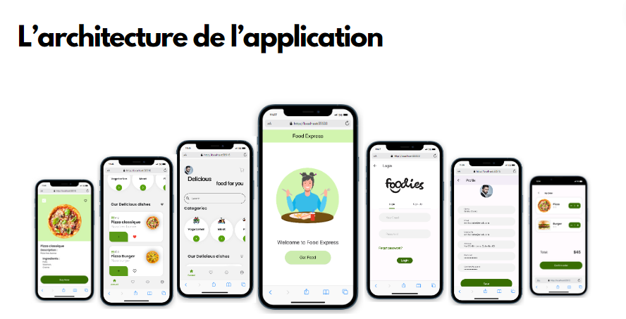

# Delivecrous-front
# Projet de Commande de Repas  - Frontend

Ce dépôt contient le code source de la partie frontend de l'application de commande de repas cross-plateforme "Deliverucrous", similaire à "UberEats".

## Technologies Utilisées
- Framework : Flutter
- Langages : dart

## Architecture du Projet

## Fonctionnalités Implémentées
- Écran de listing des plats avec filtres par category et recherche et trie par prix
- Écran de détail d'un plat avec allergènes et ingredients
- Système de panier avec récapitulatif et gestion des quantités
- Écran de validation de commande ( si le solde lui permet --> Orderconfirmed sinon --> orderError)
- Gestion d'informations utilisateur pour le solde de la carte CROUS
- Ecran de liste de favoris
- Ecran des commandes passés 
- Ecran d'accueil
- Ecran d'inscription, connexion et changement de mot de passe dans le cas l'utilisateur a oublié son mot  de passe 
## Fonctionnalités Bonus
- Authentification utilisateur au démarrage
- Affichage d'informations utilisateur et historique des commandes
- Suivi de commande en temps réel

## Instructions pour Exécuter le Projet
1. Clonez ce dépôt : `git clone [https://github.com/JulieMusique/Delivecrous-front.git]`
2. Installez les dépendances : `[flutter pub get]`
3. Lancez l'application : `[flutter run]`
4. Relancement de l'application : `[r ou R]`
